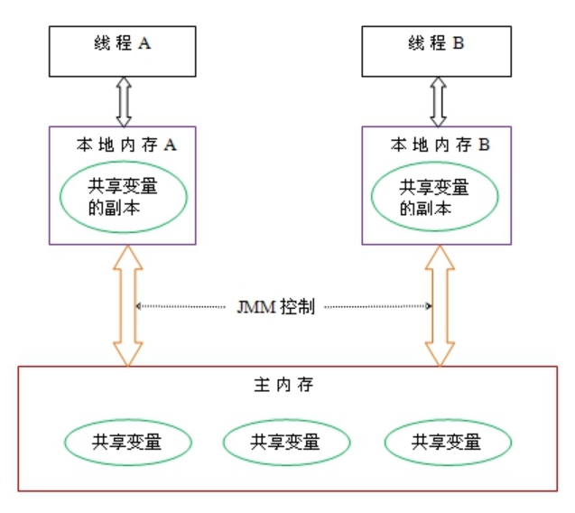
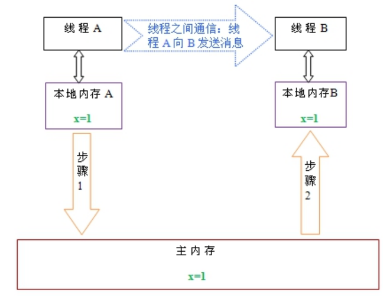
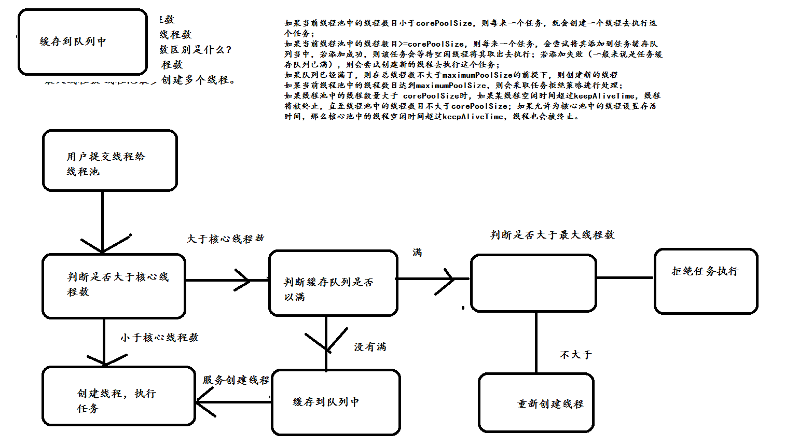

### 多线程学习
### [一、多线程基础](./docs/1.多线程基础.md)
#### 1.进程与线程的区别？
答:进程是所有线程的集合，每一个线程是进程中的一条执行路径，线程只是一条执行路径。

#### 2.为什么要用多线程？
答:提高程序效率

#### 3.多线程创建方式？
答:继承Thread或Runnable 接口。

同步概念：代码从上往下进行执行

异步概念：开一个新一条执行路径，进行执行。
#### 4.是继承Thread类好还是实现Runnable接口好？
答:Runnable接口好，因为实现了接口还可以继续继承。继承Thread类不能再继承。
#### 5.你在哪里用到了多线程？
答:主要能体现到多线程提高程序效率。
举例:分批发送短信、迅雷多线程下载等。
#### 6.多线程创建方式
##### 1.继承 Thread 类  重写 run 方法
##### 2. 实现 Runnable 接口，重写 run 方法
##### 3. 使用匿名内部类方式


常用线程api方法 | 注释
---|---
start() | 启动线程
currentThread() | 获取当前线程对象
getID() | 获取当前线程 ID Thread-编号 该编号冲 0  开始
getName() | 获取当前线程名称
sleep(long mill) |	休眠线程
Stop（）|	停止线程

常用线程构造函数 |注释
---|---
Thread（） |	分配一个新的 Thread 对象
Thread（String name）	| 分配一个新的 Thread对象，具有指定的 name正如其名。
Thread（Runable r）|	分配一个新的 Thread对象
Thread（Runable r, String name）	|分配一个新的 Thread对象

#### 多线程运行状态

线程从创建、运行到结束总是处于下面五个状态之一：新建状态、就绪状态、运行状态、阻塞状态及死亡状态。

#### 守护线程
Java中有两种线程，一种是用户线程，另一种是守护线程。
用户线程是指用户自定义创建的线程，主线程停止，用户线程不会停止
守护线程当进程不存在或主线程停止，守护线程也会被停止。
使用setDaemon(true)方法设置为守护线程

Thread thread = new Thread(new Runnable())

### [二、线程安全](./docs/2.线程安全.md)
#### 为什么有线程安全问题？
当多个线程同时共享，同一个全局变量或静态变量，做写的操作时，可能会发生数据冲突问题，也就是线程安全问题。但是做读操作是不会发生数据冲突问题。
#### 线程安全解决办法:
##### 问:如何解决多线程之间线程安全问题
答:使用多线程之间同步synchronized或使用锁(lock)。
##### 问:为什么使用线程同步或使用锁能解决线程安全问题呢？
答:将可能会发生数据冲突问题(线程不安全问题)，只能让当前一个线程进行执行。代码执行完成后释放锁，让后才能让其他线程进行执行。这样的话就可以解决线程不安全问题。
##### 问:什么是多线程之间同步
答:当多个线程共享同一个资源,不会受到其他线程的干扰。
#### 内置的锁
Java提供了一种内置的锁机制来支持原子性
每一个Java对象都可以用作一个实现同步的锁，称为内置锁，线程进入同步代码块之前自动获取到锁，代码块执行完成正常退出或代码块中抛出异常退出时会释放掉锁

内置锁为互斥锁，即线程A获取到锁后，线程B阻塞直到线程A释放锁，线程B才能获取到同一个锁
内置锁使用synchronized关键字实现，synchronized关键字有两种用法：

1.修饰需要进行同步的方法（所有访问状态变量的方法都必须进行同步），此时充当锁的对象为调用同步方法的对象

2.同步代码块和直接使用synchronized修饰需要同步的方法是一样的，但是锁的粒度可以更细，并且充当锁的对象不一定是this，也可以是其它对象，所以使用起来更加灵活

#### 同步的前提：
1，必须要有两个或者两个以上的线程

2，必须是多个线程使用同一个锁

必须保证同步中只能有一个线程在运行

好处：解决了多线程的安全问题

弊端：多个线程需要判断锁，较为消耗资源、抢锁的资源。

#### 同步方法使用的是什么锁？
答：同步函数使用this锁。

#### 静态同步函数
答：什么是静态同步函数？
方法上加上static关键字，使用synchronized 关键字修饰 或者使用类.class文件。
静态的同步函数使用的锁是  该函数所属字节码文件对象
可以用 getClass方法获取，也可以用当前  类名.class 表示。

总结：
synchronized 修饰方法使用锁是当前this锁。
synchronized 修饰静态方法使用锁是当前类的字节码文件

#### 什么是多线程死锁？
答:同步中嵌套同步,导致锁无法释放

#### 什么是Threadlocal
ThreadLocal提高一个线程的局部变量，访问某个线程拥有自己局部变量。

当使用ThreadLocal维护变量时，ThreadLocal为每个使用该变量的线程提供独立的变量副本，所以每一个线程都可以独立地改变自己的副本，而不会影响其它线程所对应的副本。

#### ThreadLocal的接口方法
ThreadLocal类接口很简单，只有4个方法，我们先来了解一下：
1.  void set(Object value)设置当前线程的线程局部变量的值。
2.	public Object get()该方法返回当前线程所对应的线程局部变量。
3.	public void remove()将当前线程局部变量的值删除，目的是为了减少内存的占用，该方法是JDK 5.0新增的方法。需要指出的是，当线程结束后，对应该线程的局部变量将自动被垃圾回收，所以显式调用该方法清除线程的局部变量并不是必须的操作，但它可以加快内存回收的速度。
4.	protected Object initialValue()返回该线程局部变量的初始值，该方法是一个protected的方法，显然是为了让子类覆盖而设计的。这个方法是一个延迟调用方法，在线程第1次调用get()或set(Object)时才执行，并且仅执行1次。ThreadLocal中的缺省实现直接返回一个null。

#### 多线程有三大特性
原子性、可见性、有序性

##### 什么是原子性
即一个操作或者多个操作 要么全部执行并且执行的过程不会被任何因素打断，要么就都不执行。

一个很经典的例子就是银行账户转账问题：

比如从账户A向账户B转1000元，那么必然包括2个操作：从账户A减去1000元，往账户B加上1000元。这2个操作必须要具备原子性才能保证不出现一些意外的问题。
我们操作数据也是如此，比如i = i+1；其中就包括，读取i的值，计算i，写入i。这行代码在Java中是不具备原子性的，则多线程运行肯定会出问题，所以也需要我们使用同步和lock这些东西来确保这个特性了。
原子性其实就是保证数据一致、线程安全一部分，

##### 什么是可见性
当多个线程访问同一个变量时，一个线程修改了这个变量的值，其他线程能够立即看得到修改的值。
若两个线程在不同的cpu，那么线程1改变了i的值还没刷新到主存，线程2又使用了i，那么这个i值肯定还是之前的，线程1对变量的修改线程没看到这就是可见性问题。
##### 什么是有序性
程序执行的顺序按照代码的先后顺序执行。
一般来说处理器为了提高程序运行效率，可能会对输入代码进行优化，它不保证程序中各个语句的执行先后顺序同代码中的顺序一致，但是它会保证程序最终执行结果和代码顺序执行的结果是一致的。如下：

int a = 10;    //语句1

int r = 2;    //语句2

a = a + 3;    //语句3

r = a*a;     //语句4

则因为重排序，他还可能执行顺序为 2-1-3-4，1-3-2-4
但绝不可能 2-1-4-3，因为这打破了依赖关系。
显然重排序对单线程运行是不会有任何问题，而多线程就不一定了，所以我们在多线程编程时就得考虑这个问题了。

#### Java内存模型
共享内存模型指的就是Java内存模型(简称JMM)，JMM决定一个线程对共享变量的写入时,能对另一个线程可见。从抽象的角度来看，JMM定义了线程和主内存之间的抽象关系：线程之间的共享变量存储在主内存（main memory）中，每个线程都有一个私有的本地内存（local memory），本地内存中存储了该线程以读/写共享变量的副本。本地内存是JMM的一个抽象概念，并不真实存在。它涵盖了缓存，写缓冲区，寄存器以及其他的硬件和编译器优化。


从上图来看，线程A与线程B之间如要通信的话，必须要经历下面2个步骤：
1. 首先，线程A把本地内存A中更新过的共享变量刷新到主内存中去。
2. 然后，线程B到主内存中去读取线程A之前已更新过的共享变量。

总结：什么是Java内存模型：java内存模型简称jmm，定义了一个线程对另一个线程可见。共享变量存放在主内存中，每个线程都有自己的本地内存，当多个线程同时访问一个数据的时候，可能本地内存没有及时刷新到主内存，所以就会发生线程安全问题。

####  java 内存结构


#### 什么是Volatile
可见性也就是说一旦某个线程修改了该被volatile修饰的变量，它会保证修改的值会立即被更新到主存，当有其他线程需要读取时，可以立即获取修改之后的值。
在Java中为了加快程序的运行效率，对一些变量的操作通常是在该线程的寄存器或是CPU缓存上进行的，之后才会同步到主存中，而加了volatile修饰符的变量则是直接读写主存。

Volatile 保证了线程间共享变量的及时可见性，但不能保证原子性

#### Volatile特性
1.保证此变量对所有的线程的可见性，这里的“可见性”，如本文开头所述，当一个线程修改了这个变量的值，volatile 保证了新值能立即同步到主内存，以及每次使用前立即从主内存刷新。但普通变量做不到这点，普通变量的值在线程间传递均需要通过主内存（详见：Java内存模型）来完成。

2.禁止指令重排序优化。有volatile修饰的变量，赋值后多执行了一个“load addl $0x0, (%esp)”操作，这个操作相当于一个内存屏障（指令重排序时不能把后面的指令重排序到内存屏障之前的位置），只有一个CPU访问内存时，并不需要内存屏障；（什么是指令重排序：是指CPU采用了允许将多条指令不按程序规定的顺序分开发送给各相应电路单元处理）。

volatile 性能：
volatile 的读性能消耗与普通变量几乎相同，但是写操作稍慢，因为它需要在本地代码中插入许多内存屏障指令来保证处理器不发生乱序执行。

#### Volatile与Synchronized区别
1. 从而我们可以看出volatile虽然具有可见性但是并不能保证原子性。

2. 性能方面，synchronized关键字是防止多个线程同时执行一段代码，就会影响程序执行效率，而volatile关键字在某些情况下性能要优于synchronized。
   但是要注意volatile关键字是无法替代synchronized关键字的，因为volatile关键字无法保证操作的原子性。
### 三、线程间通讯
1. 什么是线程之间的通讯？
   多线程之间通讯，其实就是多个线程在操作同一个资源，但是操作的动作不同。
1. wait、notify方法
   1. 因为涉及到对象锁,他们必须都放在synchronized中来使用. Wait、Notify一定要在synchronized里面进行使用。
   2. Wait必须暂定当前正在执行的线程,并释放资源锁,让其他线程可以有机会运行
   3. notify/notifyall: 唤醒因锁池中的线程,使之运行
   
   注意：一定要在线程同步中使用，并且是同一个锁的资源。

3. wait 与 sleep 区别
   1. 对于 sleep 方法，是属于 Thread 类中的，而 wait 方法是属于 Object 类中的。
   2. sleep 方法导致了程序暂停执行指定的时间，让出 CPU 给其他线程，但是它的监控状态依然保持着，当指定的时间到了又会自动恢复运行状态。
   3. 在调用 sleep 方法的过程中，线程不会释放对象锁。
   4. 而当调用 wait 方法的时候，线程会放弃对象锁，进入等待此对象的等待锁定池，只有针对此对象调用 notify() 方法后，本线程才进入对象锁定池准备获取对象锁进入运行状态。
4. lock 与 synchronized 关键字的区别
   1. Lock 接口可以尝试非阻塞的获取锁，当前线程尝试获取锁。如果这一时刻没有被其他线程获取到，则成功获取并持有锁。
   2. Lock 接口能被中断的获取锁 与 synchronized 不同，获取到锁的线程能够响应中断，当获取到的锁的线程被中断时，中断异常将会抛出，同事锁会被释放。
   3. Lock 接口在指定的截止时间之前获取锁，如果截止时间到了依旧没法获取锁，则返回。
### 四、并发队列
1. 在并发队列上 JDK 提供了两套实现，一个是以 ConcurrentLinkedQueue 为代表的高性能对象非阻塞队列，一个是以 BlockingQueue 接口为代表的阻塞队列，都继承 Queue.
2. 阻塞队列与普通队列的区别在于，当队列是空的时，从队列中获取元素的操作将会被阻塞，或者当满时，往队列里添加元素的操作会被阻塞。
### 五、线程池
   1. 线程池的作用
      1. 降低资源消耗。通过重复利用已创建的线程降低线程创建和销毁造成的销毁
      2. 提高响应速度。当任务到达时，任务可以不需要等到线程创建就能立即执行。
      3. 提高线程的可管理性。线程是稀缺资源，如果无限制的创建，不仅会销毁系统资源，还会降低系统的稳定性，使用线程池可以进行统一分配、调优和监控。
   2. 线程池原理剖析
      提交一个任务到线程池中，线程池的处理流程如下：
      1. 判断线程池里的核心线程是否都在执行任务，如果不是（核心线程空闲或者还有核心线程没有被创建）则创建一个新的工作线程来执行任务。如果核心线程都在执行任务，则进入下个流程。
      2. 线程池判断工作队列是否已满，如果工作队列没有满，则将新提交的任务存储在这个工作队列里。如果工作队列满了，则进入下个流程。
      3. 判断线程池里的线程是否都处于工作状态，如果没有，则创建一个新的工作线程来执行任务。如果已经满了，则交给饱和策略来处理这个任务。
      
   3. 合理配置线程池
      1. CPU密集的意思是该任务需要大量的运算，而没有阻塞，CPU一直全速运行。
      2. IO密集型，即该任务需要大量的IO，即大量的阻塞。
      3. CPU密集型时，任务可以少配置线程数，大概和机器的cpu核数相当，这样可以使得每个线程都在执行任务 
      4. IO密集型时，大部分线程都阻塞，故需要多配置线程数，2*cpu核数
### 六、锁的深度化
1. 重入锁
   1. 重入锁，也叫做递归锁，指的是同一线程 外层函数获得锁之后 ，内层递归函数仍然有获取该锁的代码，但不受影响。
   2. ReentrantLock 和synchronized 都是 可重入锁
2. 读写锁
   1. 在没有写操作的时候，两个线程同时读一个资源没有任何问题，所以应该允许多个线程能在同时读取共享资源。但是如果有一个线程想去写这些共享资源，
   就不应该再有其它线程对该资源进行读或写（译者注：也就是说：读-读能共存，读-写不能共存，写-写不能共存）。
   这就需要一个读/写锁来解决这个问题。
    ```java
    // 读写锁
    private ReentrantReadWriteLock reentrantReadWriteLock = new ReentrantReadWriteLock();
    // 写入锁
    private WriteLock writeLock = reentrantReadWriteLock.writeLock();
    // 读取锁
    private ReadLock readLock = reentrantReadWriteLock.readLock();
    ```
3. 悲观锁、乐观锁
   1. 乐观锁 :总是认为不会产生并发问题，每次去取数据的时候总认为不会有其他线程对数据进行修改，因此不会上锁，但是在更新时会判断其他线程在这之前有没有对数据进行修改，一般会使用版本号机制或CAS操作实现。
   2. 悲观锁 :总是假设最坏的情况，每次取数据时都认为其他线程会修改，所以都会加锁（读锁、写锁、行锁等），当其他线程想要访问数据时，都需要阻塞挂起。可以依靠数据库实现，如行锁、读锁和写锁等，都是在操作之前加锁，在Java中，synchronized的思想也是悲观锁。