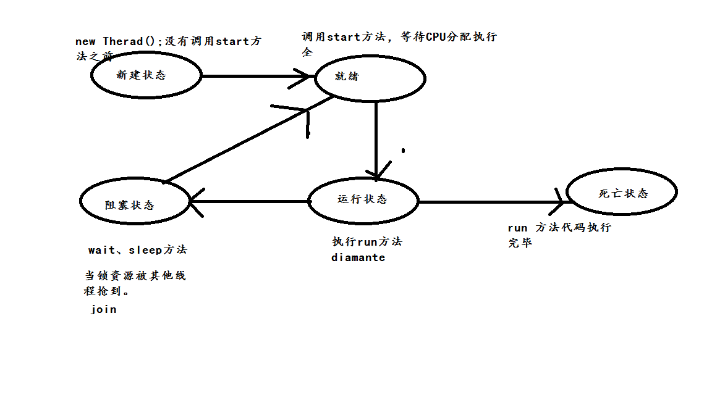

#### 1.进程与线程的区别？
答:进程是所有线程的集合，每一个线程是进程中的一条执行路径，线程只是一条执行路径。

#### 2.为什么要用多线程？
答:提高程序效率

#### 3.多线程创建方式？
答:继承Thread或Runnable 接口。

同步概念：代码从上往下进行执行

异步概念：开一个新一条执行路径，进行执行。
#### 4.是继承Thread类好还是实现Runnable接口好？
答:Runnable接口好，因为实现了接口还可以继续继承。继承Thread类不能再继承。
#### 5.你在哪里用到了多线程？
答:主要能体现到多线程提高程序效率。
举例:分批发送短信、迅雷多线程下载等。
#### 6.多线程创建方式
##### 1.继承 Thread 类  重写 run 方法
##### 2. 实现 Runnable 接口，重写 run 方法
##### 3. 使用匿名内部类方式

常用线程api方法 | 注释
---|---
start() | 启动线程
currentThread() | 获取当前线程对象
getID() | 获取当前线程 ID Thread-编号 该编号冲 0  开始
getName() | 获取当前线程名称
sleep(long mill) |	休眠线程
Stop（）|	停止线程

常用线程构造函数 |注释
---|---
Thread（） |	分配一个新的 Thread 对象
Thread（String name）	| 分配一个新的 Thread对象，具有指定的 name正如其名。
Thread（Runable r）|	分配一个新的 Thread对象
Thread（Runable r, String name）	|分配一个新的 Thread对象

#### 多线程运行状态

线程从创建、运行到结束总是处于下面五个状态之一：新建状态、就绪状态、运行状态、阻塞状态及死亡状态。

#### 守护线程
Java中有两种线程，一种是用户线程，另一种是守护线程。
用户线程是指用户自定义创建的线程，主线程停止，用户线程不会停止
守护线程当进程不存在或主线程停止，守护线程也会被停止。
使用setDaemon(true)方法设置为守护线程

Thread thread = new Thread(new Runnable())
thread.setDaemon(true);
thread.start();